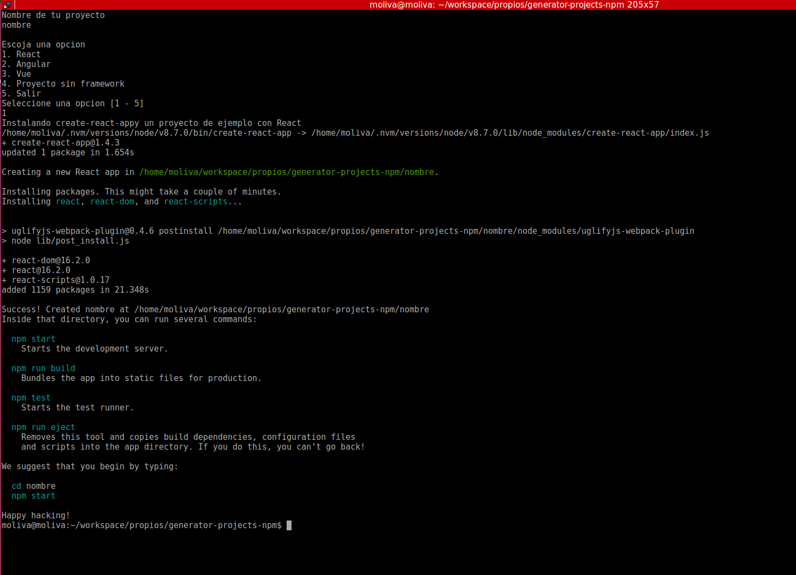

# generator-projects-npm
Generador de proyectos en npm, Te pregunta el nombre y el tipo de framework a instalar.

#### Como se usa

En tu consola lanza el siguiente comando.

```
./generador.sh
```

#### Un ejemplo de un proceso completo


